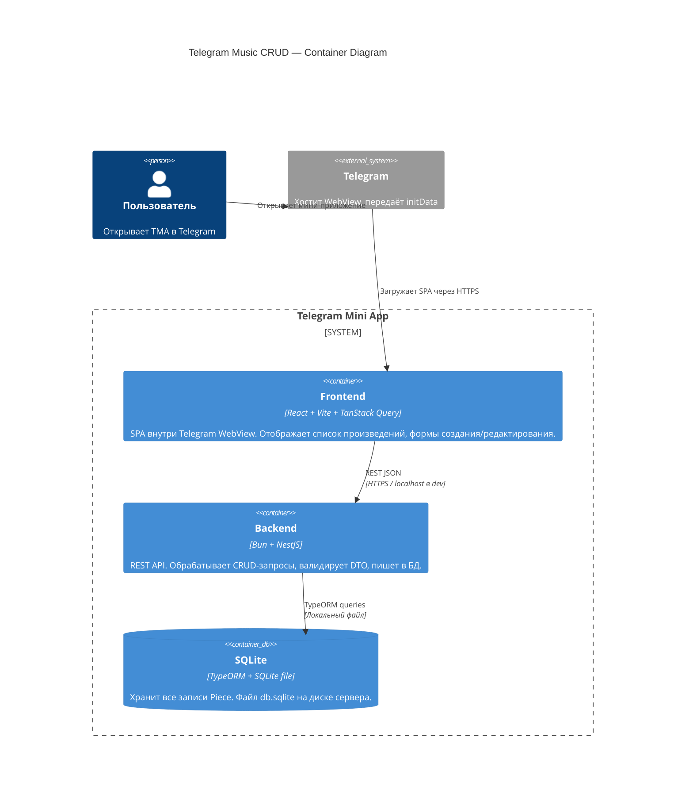

# 01_DES_architecture.md

---

## 1. Стек и обоснование

| Слой | Технология | Обоснование |
|------|-----------|-------------|
| Frontend framework | React 18 + Vite + TypeScript | Стандарт для TMA; Vite даёт быстрый HMR и лёгкий билд |
| Server state | TanStack Query v5 | Кэш, фоновые обновления и мутации без boilerplate; заменяет useEffect+useState для всех HTTP-вызовов |
| TMA-интеграция | `@telegram-apps/sdk` | Официальный SDK: тема, MainButton, BackButton, initData |
| Backend runtime | Bun | Нативный SQLite-драйвер, быстрый старт, совместим с Node-экосистемой |
| Backend framework | NestJS | Модульность, встроенный DI, декораторы для REST; легко тестировать по слоям |
| База данных | SQLite via TypeORM | Нет отдельного сервера БД; TypeORM даёт миграции и типизированные entity |
| Монорепо | Bun workspaces | Единый `bun install`, общий `node_modules`, один CI/CD пайплайн |

---

## 2. Структура монорепозитория

```
/
├── package.json              # root — workspaces: ["apps/*"]
├── bunfig.toml               # глобальные настройки Bun
├── .github/
│   └── workflows/
│       └── ci.yml            # единый пайплайн: lint → test → build
│
├── apps/
│   ├── frontend/
│   │   ├── package.json
│   │   ├── vite.config.ts
│   │   ├── index.html
│   │   └── src/
│   │       ├── main.tsx
│   │       ├── App.tsx
│   │       ├── api/
│   │       │   └── pieces.ts       # axios/fetch функции (queryFn / mutationFn)
│   │       ├── hooks/
│   │       │   └── usePieces.ts    # useQuery / useMutation обёртки
│   │       ├── components/
│   │       │   ├── PieceList.tsx
│   │       │   ├── PieceForm.tsx
│   │       │   └── PieceItem.tsx
│   │       └── types/
│   │           └── piece.ts        # shared-тип Piece (дублируется, см. принцип 4)
│   │
│   └── backend/
│       ├── package.json
│       ├── src/
│       │   ├── main.ts             # bootstrap NestJS + Bun
│       │   ├── app.module.ts
│       │   └── pieces/
│       │       ├── pieces.module.ts
│       │       ├── pieces.controller.ts
│       │       ├── pieces.service.ts
│       │       ├── piece.entity.ts  # TypeORM Entity
│       │       └── dto/
│       │           ├── create-piece.dto.ts
│       │           └── update-piece.dto.ts
│       └── data/
│           └── db.sqlite           # файл БД (в .gitignore)
```

---

## 3. C4-диаграмма (Container level)



---

## 4. Архитектурные принципы

**1. TanStack Query — единственный источник истины для серверных данных.**
Никакого `useState` для данных с сервера. Все GET → `useQuery`, все POST/PUT/DELETE → `useMutation` с `invalidateQueries` после успеха.

**2. Backend = тонкий CRUD без бизнес-логики.**
Controller принимает запрос → Service делает одну операцию TypeORM → возвращает Entity или DTO. Никакой логики в Controller, никаких HTTP-деталей в Service.

**3. Один источник правды для типов — каждый пакет держит свои.**
Пока нет shared-пакета, тип `Piece` дублируется в `frontend/types/piece.ts` и `piece.entity.ts`. Это допустимо — не усложняй монорепо третьим пакетом ради одного интерфейса.

**4. SQLite-файл вне `src/`.**
`data/db.sqlite` лежит в `apps/backend/data/` и добавлен в `.gitignore`. TypeORM настраивается через `ormconfig` или `TypeOrmModule.forRoot` с относительным путём.

**5. Единая команда запуска из корня.**
`bun run dev` в корне поднимает оба приложения параллельно через `bun --filter '*' dev`. CI запускает `bun run build` и `bun run test` из корня — никаких `cd apps/frontend`.